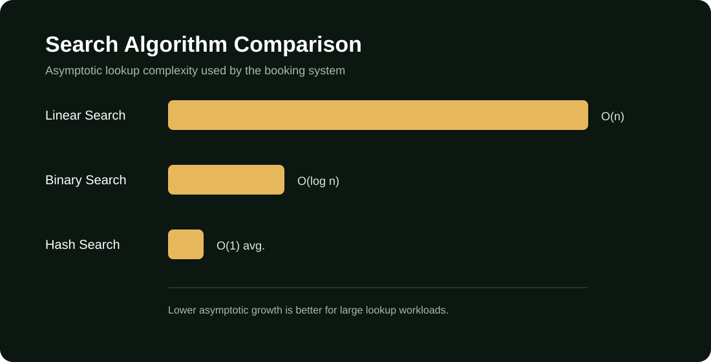
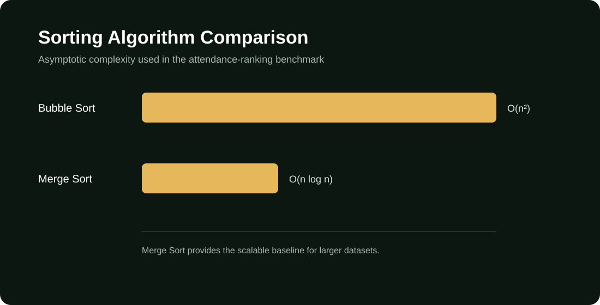

# Match Ticket Booking System

<div align="center">


</div>

A Python-based **Data Structures & Algorithms** project that models high-demand football ticket booking and evaluates how data-structure and algorithm choices affect lookup, sorting, queueing, and booking performance.

> **Course:** EE367 — Data Structures & Algorithms  
> **Institution:** King Abdulaziz University  
> **Department:** Electrical & Computer Engineering

## Why This Project Exists

A ticket release can create a burst of users competing for a limited number of seats. The project treats that as an algorithmic problem: how should users be stored, requests prioritized, seats represented, and records searched or sorted?

The system implements the structures and algorithms manually rather than relying on Python's built-in dictionary, heap, or sorting primitives for the core demonstrations.

## Core Design

### Standard vs. Optimized

| Area | Standard / Baseline | Optimized |
|---|---|---|
| User lookup | Linear Search — O(n) | Hash Search — O(1) average |
| Sorted lookup | — | Binary Search — O(log n) |
| Attendance sorting | Bubble Sort — O(n²) | Merge Sort — O(n log n) |
| Booking queue | Priority scan over list | Binary Min-Heap — O(log n) push/pop |
| Seat state | — | 2-D Array — O(1) indexed access |

This lets the project connect theoretical complexity to a realistic workload.

## Data Structures & Algorithms

| Component | Implementation | Complexity | Purpose |
|---|---|---:|---|
| User lookup | Custom Hash Table | O(1) average | Fast Fan ID lookup |
| Booking queue | Binary Min-Heap | O(log n) push/pop | Process requests by priority |
| Seat management | 2-D Array | O(1) indexed access | Track seat availability |
| Sorting | Merge Sort | O(n log n) | Efficient attendance ordering |
| Sorting baseline | Bubble Sort | O(n²) | Comparison baseline |
| Searching | Binary Search | O(log n) | Lookup in sorted data |
| Searching baseline | Linear Search | O(n) | Comparison baseline |
| Searching optimized | Hash Search | O(1) average | Direct lookup through the hash table |

## Booking Priority Model

Requests are processed according to user tier:

1. **VIP** — highest priority
2. **High Attendance** — medium priority
3. **General** — lowest priority

The binary min-heap orders requests by `(tier, timestamp)`, so higher-priority requests are processed first while requests within the same tier retain arrival order.

## Seat Model

The simulated stadium contains **392 seats**:

| Zone | Seats | Price Multiplier |
|---|---:|---:|
| VIP | 48 | ×4 |
| Premium / High | 144 | ×2 |
| General | 200 | ×1 |
| **Total** | **392** | — |

Users can select up to two seats per match. Each zone is represented by a dedicated 2-D seat grid.

## System Flow

```text
Real-world booking problem
          ↓
Data structure selection
          ↓
Algorithm implementation
          ↓
Baseline implementation
          ↓
Booking simulation
          ↓
Benchmarking + KPI collection
          ↓
Performance analysis
```

## Performance Evaluation

The benchmark layer compares:

### Search

- Linear Search — **O(n)**
- Binary Search — **O(log n)**
- Hash Search — **O(1) average**



### Sorting

- Bubble Sort — **O(n²)**
- Merge Sort — **O(n log n)**



The diagrams above show the algorithmic complexity being evaluated. Runtime measurements are generated by `benchmark_extended()` in `booking_system.py`.

## KPIs

The booking engine tracks:

- Average waiting time
- Processing time
- Throughput
- Lookup time
- Occupancy
- Revenue
- Processed and rejected bookings
- Per-tier booking counts

These metrics connect the DSA implementations to observable system behavior.

## Project Structure

```text
match-ticket-booking-system/
├── README.md
├── .gitignore
├── assets/
│   └── project-banner.svg
├── src/
│   ├── main.py
│   └── modules/
│       ├── __init__.py
│       ├── booking_system.py
│       ├── hash_table.py
│       ├── match_catalogue.py
│       ├── mock_database.py
│       ├── models.py
│       ├── priority_queue.py
│       ├── searching.py
│       ├── seat_grid.py
│       ├── sorting.py
│       └── user_store.py
├── results/
│   ├── search-algorithm-comparison.svg
│   └── sorting-algorithm-comparison.svg
└── docs/
    └── README.md
```

## Requirements

- Python **3.8+**
- Standard library only

No third-party Python packages are required.

## Run

From the repository root:

```bash
python src/main.py
```

The entry point runs a small end-to-end demonstration: user lookup, booking request submission, priority processing, seat assignment, and algorithm benchmarking.

## Example IDs

The deterministic mock dataset includes IDs such as:

```text
VIP001
VIP002
HA001
HA005
GP001
GP010
```

Unknown IDs are registered as General-tier users and persisted locally in `src/registered_users.json`, which is intentionally excluded from Git tracking.

## Engineering Takeaways

This project demonstrates practical use of:

- Hash tables and collision handling
- Binary heaps and priority scheduling
- 2-D arrays
- Searching and sorting algorithms
- Big-O complexity analysis
- Simulation and benchmarking
- KPI-based performance evaluation
- Modular Python design

## Academic Materials

The original course report and presentation are intentionally kept outside this public repository because they contain student identification numbers. They can be published separately after removing personal identifiers if the team chooses to do so.

## Team

- Abdulaziz Alzahrani — GUI & Coding
- Abdullah Almutiri — Report Writing & Coding
- Abdulaziz Alqassab — Presentation & Coding
- Ali Almalki — GUI & Coding

## License

Academic team project for EE367 at King Abdulaziz University. No open-source license is declared.
